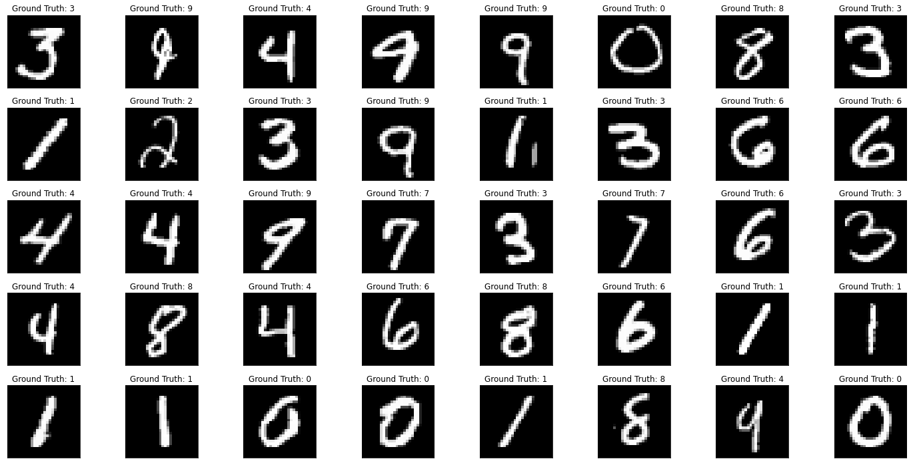

# A convolutional network in PyTorch to recognize handwritten digits as given in the MNIST dataset
<<<<<<< HEAD
=======

[PyTorch Documentation](https://pytorch.org/tutorials/beginner/pytorch_with_examples.html)
>>>>>>> a7a29238cb6078679173bafb3cfd3867369121b2

[PyTorch Documentation](https://pytorch.org/tutorials/beginner/pytorch_with_examples.html)
[Description of the dataset we will be working with](https://en.wikipedia.org/wiki/MNIST_database)

An example of the test data




##

## Using GPU

One advantage of using pytorch as a framework is that it allows us to execute our code on the GPU. This can often greatly reduce the runtime needed to train neural networks. Below is a short description of how to do this.

<<<<<<< HEAD

### CNN

Below you can see a diagram for a convolutional network. THe diagram is translated into a PyTorch model by filling in the `Net` class below.


After each max pooling step and after the first dense (linear) layer apply the relu activation function.
We use the modules `nn.Conv2d`, `nn.Linear` and the functions `F.max_pool2d` and `F.relu`.

*Hint: Carefully inspect the shapes of the intermediate layers and add padding to the convolutions where necessary.*
=======
```
if torch.cuda.is_available():                     # if a GPU is available for pytorch
  DEVICE = torch.device('cuda')
else:
  DEVICE = torch.device('cpu')
```


## CNN

Below you can see a diagram for a convolutional network. 


The diagram is translated into a PyTorch model by filling in the `Net` class below.

```
class Net(nn.Module):
  def __init__(self):
    super(Net, self).__init__()
    self.conv1 = nn.Conv2d(1, 10, kernel_size=5)
    self.conv2 = nn.Conv2d(10, 20, kernel_size=5, padding='same') 
    self.linear1 = nn.Linear(720,50)
    self.linear2 = nn.Linear(50,10)

  def forward(self, x):
    x1 = F.relu(F.max_pool2d(self.conv1(x), 2))
    x2 = F.relu(F.max_pool2d(self.conv2(x1), 2))
    
    batch_size = x.shape[0]
    x2 = x2.view(batch_size,-1)

    y1 = torch.nn.functional.relu(self.linear1(x2))
    y = self.linear2(y1)
    return y
```

After each max pooling step and after the first dense (linear) layer apply the relu activation function.
We use the modules `nn.Conv2d`, `nn.Linear` and the functions `F.max_pool2d` and `F.relu`. We also carefully inspect the shapes of
the intermediate layers and add padding to the convolutions where necessary.
>>>>>>> a7a29238cb6078679173bafb3cfd3867369121b2
